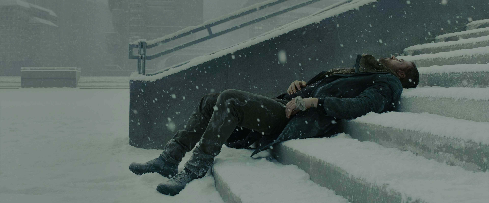
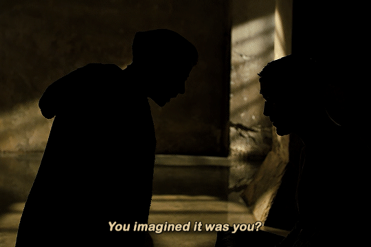
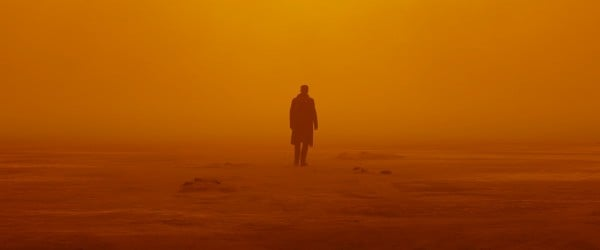

# **_Blade Runner 2049_**

This movie is a well-known science fiction movie directed by _Denis Villeneuve_ (*Dune series*) and starring _Ryan Gosling_, released in 2017. Its predecessor was "_Blade Runner_" released in 1982.

## Abstract

The story tells about a replicant blade runner, K, who accidentally discovered that he might be the offspring of a replicant, so he desperately looked for more evidence. However, after sacrificing almost everything he had, he finally found out that he was not the chosen one.

## Thoughts after watching the movie

My first impression after watching the movie is that Ryan Gosling's acting was really thrilling! He interprets and demonstrates all the characteristics of the K so well. On the surface, he is a cold and taciturn replicant, but from K's micro-expressions and eye emotions, you can feel his cautious and longing for love and hope deep inside.

The most impressive scene for me is when the replicant freedom movement leader Freysa leaned over and said to K, who was sitting in the shadows with him:
_"You imagined it was you._
_Ohh, you did..you did.._
_We all wish it was us."_
K slowly lowered his head, frowned, and trembled as the words fell. Although he didn't answer anything, his sadness, anger, and powerlessness seemed to be tangible and spread throughout the entire shot.

## Thoughts about the movie styles
#### Colors of the film

It is worth mentioning that the film's aesthetics and atmosphere are full of light, shadow, color, and storyboard. The film can be roughly divided into three main tones: cold dark blue, warm khaki, and white. When the camera is full of cold blue, the plot is dark, tense, and full of conflicts. However, when you think that the warm khaki represents a relatively warm plot, it is actually a foreshadowing before the danger comes. Only when the camera is mainly filled with white is it time for K to relax and heal himself.

#### Shots of the film

The movie has a lot of wide-angle shots accompanied by a slow advance of K, emphasizing K's loneliness in the surrounding environment, which caused me to empathize with K's thoughts and emotions throughout the movie.
